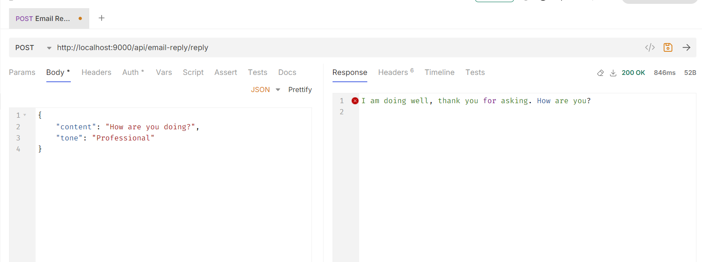
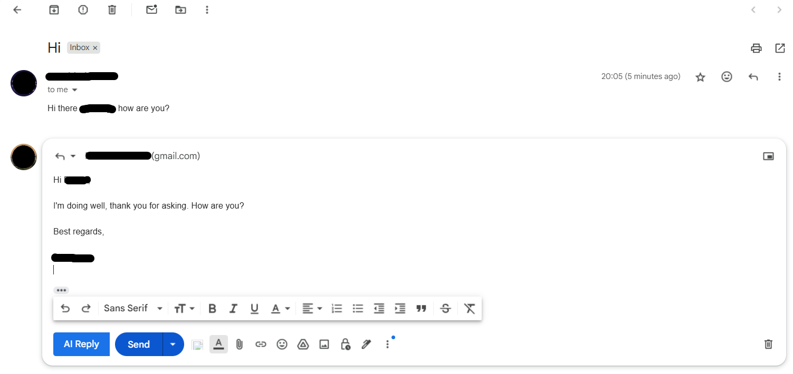
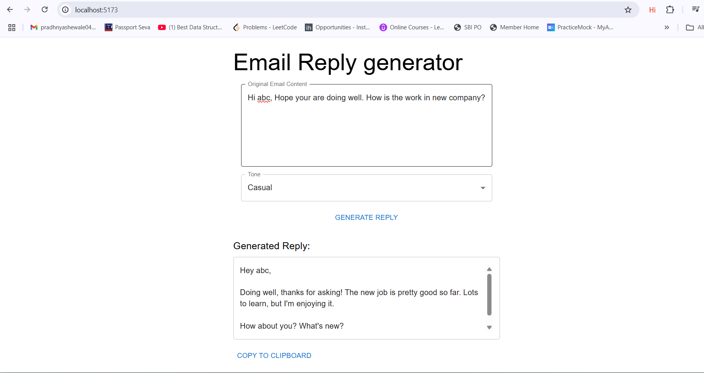

# SmartKwikReply

SmartKwikReply is an AI-powered email reply assistant. It consists of:
- A **Spring Boot backend** that connects to the Gemini AI API.
- A **React frontend** for user interaction.
- A **browser extension** that adds an "AI Reply" button to Gmail compose windows.

---

## Features

- Generate smart, context-aware email replies using Gemini AI.
- Choose the tone of your reply (e.g., friendly, professional).
- Use the web interface or the browser extension for Gmail.

---

## Screenshots

| Postman Test | Chrome Extension | Frontend UI |
|--------------|-----------------|-------------|
|  |  |  |

---

## Getting Started

### Prerequisites

- Node.js (v20 recommended)
- npm
- Java 17+
- Maven

---

### 1. Clone the Repository

```bash
git clone https://github.com/sumanbej/smartKwikReply.git
cd smartKwikReply
```

---

### 2. Backend Setup (Spring Boot)

1. **Set environment variables** (or add to `src/main/resources/application.properties`):

    ```
    GEMINI_API_KEY=your_gemini_api_key
    GEMINI_URL=https://generativelanguage.googleapis.com/v1beta/models/gemini-2.0-flash:generateContent?key=your_gemini_api_key
    ```

2. **Run the backend:**

    ```bash
    cd smartKwikReply
    mvn spring-boot:run
    ```

    The backend runs on [http://localhost:9000](http://localhost:9000).

---

### 3. Frontend Setup (React)

```bash
cd smartKwikReply-frontend
npm install
npm run dev
```

The frontend runs on [http://localhost:5173](http://localhost:5173).

---

### 4. Browser Extension

- The extension code is in `emailExtension/content.js`.
- Load as an unpacked extension in Chrome:
    1. Go to `chrome://extensions/`
    2. Enable "Developer mode"
    3. Click "Load unpacked" and select the `emailExtension` folder.

---

## API Usage

- **Endpoint:** `POST /api/email-reply/reply`
- **Request Body:**
    ```json
    {
      "content": "{{Your email content here}}",
      "tone": "friendly"
    }
    ```
- **Response:** AI-generated reply as plain text.

---

## Troubleshooting

- **CORS Issues:**  
  Make sure your backend CORS config allows requests from `http://localhost:5173` and allows credentials if needed.
- **Environment Variables:**  
  Spring Boot does not load `.env` files by default. Use environment variables or `application.properties`.
- **Node Version:**  
  Use Node.js v20 for Vite compatibility.

---

## License

MIT

---

## Credits

- [Gemini AI API](https://ai.google.dev/)
- [Spring Boot](https://spring.io/projects/spring-boot)
- [React](https://react.dev/)
- [Material UI](https://mui.com/)

---


